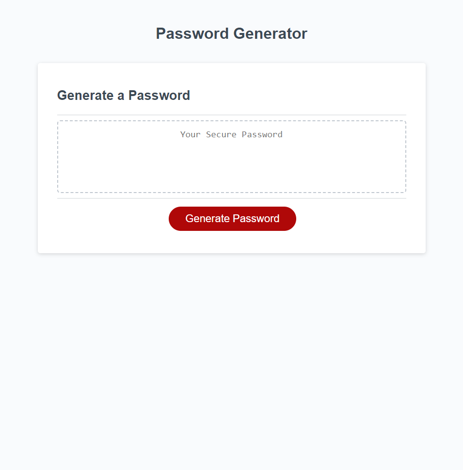

# 03 JavaScript: Password Generator

## Description 

This is a password generator that takes in user inputs through prompts to fulfill the user's desired criteria. The applicable password criteria options are:
* Password must be 8 to 128 characters in length
* Password must use at least one set of characters that are either lowercase, uppercase, numeric, and/or special characters
If the user input for the password selection options are invalid, then the user is reprompted with an appropriate alert messesage to re-enter password selection criteria.
Once the user has selected all the password criteria, the password is generated and displayed in the display container for the generated password.

## Link and Preview

https://hculp.github.io/password-generator/

